# 自动打包

介绍

1. 如何使用自己电脑下的工程自动打包
2. 部署Jenkins到打包机来远程自动打包

其中Jenkins自动打包更为灵活，支持所有打包参数。

# 环境准备

- Unity2022.3.x，如果需要打PC包，需要安装Unity的il2cpp支持模块（Windows MacOS都有该模块），HybridCLR需要依赖il2cpp
- Android-SDK
- Android-NDK

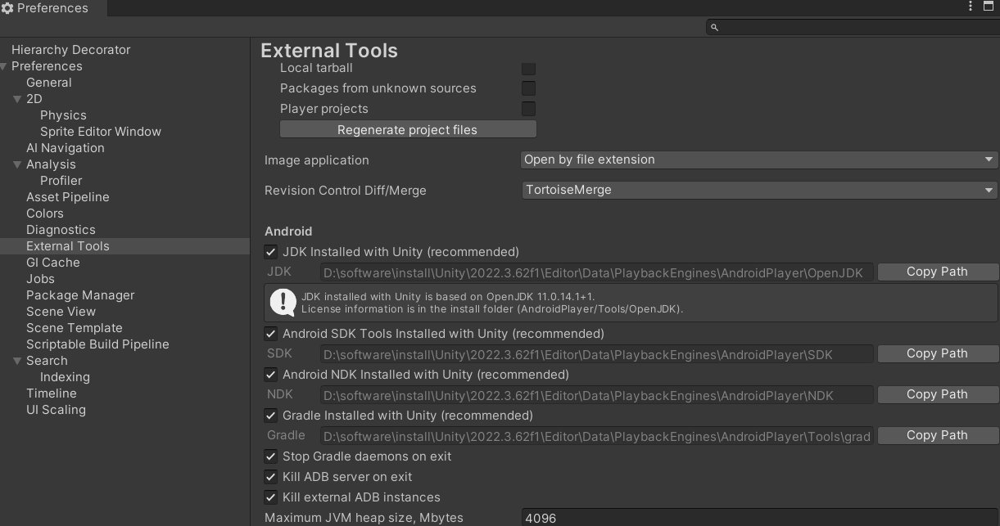

如图上所示，在Unity的Preference中设置好对应的SDK和NDK路径

# Jenkins自动打包

Jenkins自动打开部署在打包机上，就可以远程全自动打包，不需要占用自己的电脑了。

**注意也需要在部署Jenkins的电脑上，进行本篇《环境准备》前置工作**

>  **对应使用Windows和MacOS部署Jenkins的自动打包都是通用的，其中Windows可以打包Windows PC包和Android包，MacOS可以打包iOS包和Android。**
>
> 其中MacOS本来是可以打Windows PC包的，但是因为仅支持Mono模式的PC包，HybridCLR是基于il2cpp的，所以就不行了


## 部署jenkins

- [jenkins.war](https://www.jenkins.io/download/) 可以从连接下在jenkins.war包，注意要选择Generic Java package (.war)下载，这个是通用的，不要选Windows版本。
- jdk环境。**不能使用jdk8，jdk8已经不被jenkins支持，一些插件兼容性也可能有问题。**可以去官网下载最新的jdk21,[Java Downloads | Oracle](https://www.oracle.com/java/technologies/downloads/#java21)

- jdk的bin路径添加到环境变量中

## 启动Jenkins

首先需要在jenkins.war文件所在目录打开终端。

- Windows启动jenkins命令

```shell
# Powershell用这一行
$env:JAVA_TOOL_OPTIONS="-Dfile.encoding=UTF-8"; java -jar jenkins.war
# cmd用这一行
set JAVA_TOOL_OPTIONS=-Dfile.encoding=UTF-8 & java -jar jenkins.war
```

- MacOS启动jenkins命令

```
java -jar jenkins.war
```

## 设置Jenkins

### 首次启动

第一次启动完毕后，浏览器进入http://127.0.0.1:8080/ 访问Jenkins，输入默认的管理员密码，启动终端上会有密码。

然后安装默认推荐的的插件就行了，这里面的推荐插件有些就是自动打包依赖的。

接着就是让创建一个管理员用户，这个自行创建就行了。

**接着是Jenkins URL配置，就是访问地址，上面默认是127.0.0.1:8080，需要改成内网地址，否则别人电脑不能访问**

### Jenkins必备插件安装

进入Jenkins面板后，需要先装上一些自动打包必须的插件。点击左侧面板 Manager Jenkins -> System Configuration -> Plugins。再点击左侧的Available plugins，输入插件的名字就可以安装了。

- Subversion：svn支持，可选，根据需求
- [Active Choices Plug-in](https://plugins.jenkins.io/uno-choice)： 更强大的参数支持
- [Job DSL](https://plugins.jenkins.io/job-dsl)：能够使用groovy脚本灵活的维护pipeline，批量新增和修改pipeline
- [Pipeline Utility Steps](https://plugins.jenkins.io/pipeline-utility-steps)：groovy脚本的工具类
- [Authorize Project](https://plugins.jenkins.io/authorize-project) ：沙盒模式运行groovy脚本必备

### Jenkins首次的设置项

**开启groovy脚本沙盒启动用户**

进入Manager Jenkins -> Security -> Security菜单。找到Access Control for Builds选项，按照下方设置，这样才能自动使用沙盒模式运行groovy脚本。**注意这个选项要安装了Authorize Project插件后才会显示。**

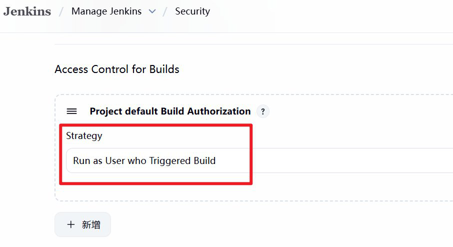

**添加Unity执行文件路径**

Manager Jenkins -> System。找到全局属性一栏，添加Unity执行文件的环境变量，然后保存。

key: Unity2022

value: 根据自己电脑的Unity.exe所在目录填写。Windows写到`Unity.exe`，MacOS需要写到`Unity.app/Contents/MacOS/Unity` 

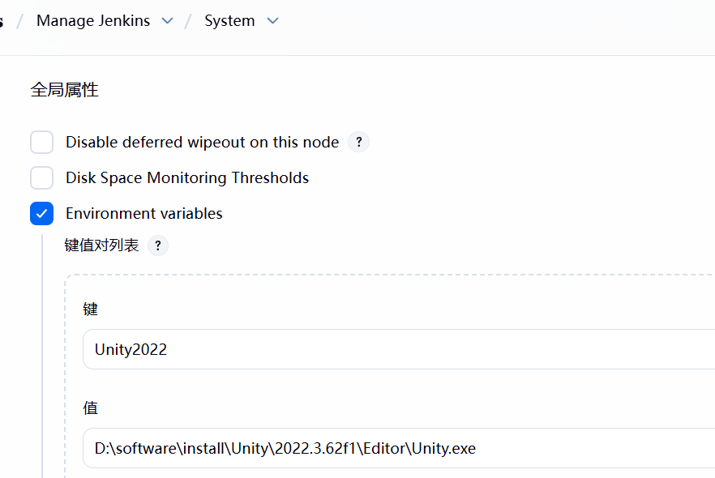


## 创建DSL Pipeline构建

>  DSL Pipeline构建是用来批量创建和更新构建的，比传统的方式维护性更为便捷，特别是要维护多个分支打包项，每个分支Windows Android iOS，以及多台打包机Jenkins维护。传统的配置方式很难应付，DSL就是可以批量管理，解决这一问题的。

首次点击Jenkins左侧面板的新建Item，输入名字，选择Pipeline的方式，然后点击确定

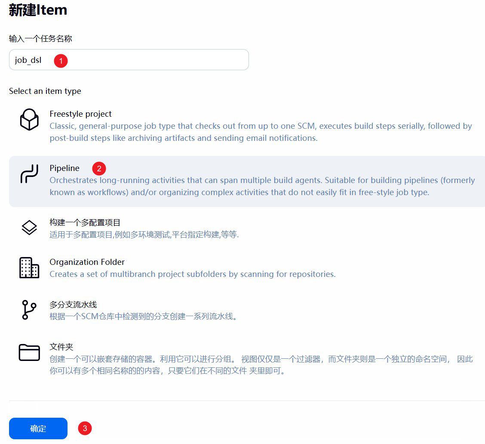

创建完之后，滚动到流水线那一栏

1. 选择Pipeline script from SCM
2. 选择Git模式
3. 输入pipeline流水线的仓库，这里使用: https://github.com/821869798/JenkinsUnityAutoBuild.git
4. 账号凭证，github公开的项目可以跳过，如果是私有的需要添加一个，这个网上教程，这里很多不赘述了。
5. 分支指定为`main` 
6. 脚本路径指定为 `scripts/create_jobs_pipeline.groovy`
7. 关闭轻量级检出(因为开这个只检出一个脚本，这里有调用仓库其他脚本)
8. 然后应用保存 

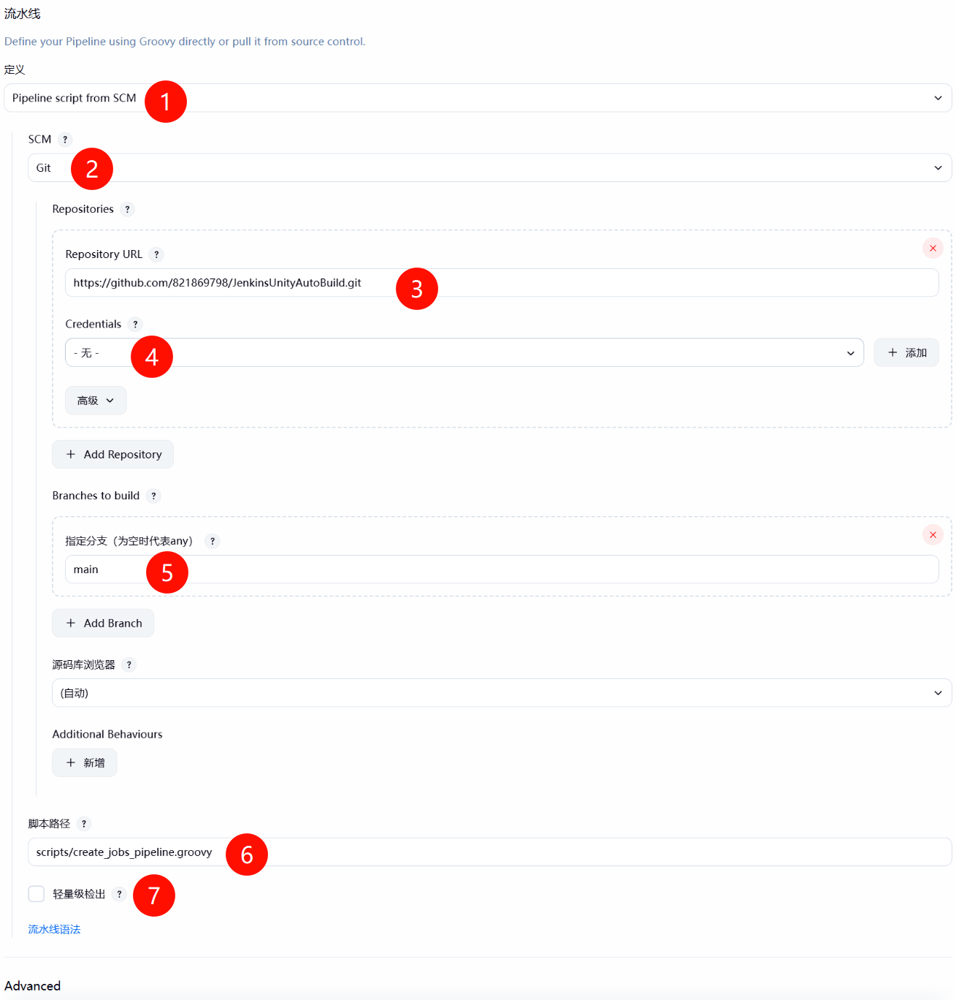

**创建好之后先构建一次，第二次就会有参数可以输入**

重要的事情再说一次，创建好之后先直接构建一次，后面的构建才能看到有参数选项

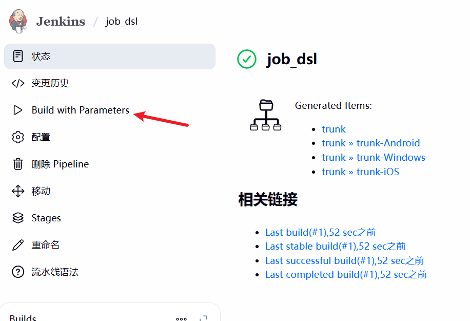


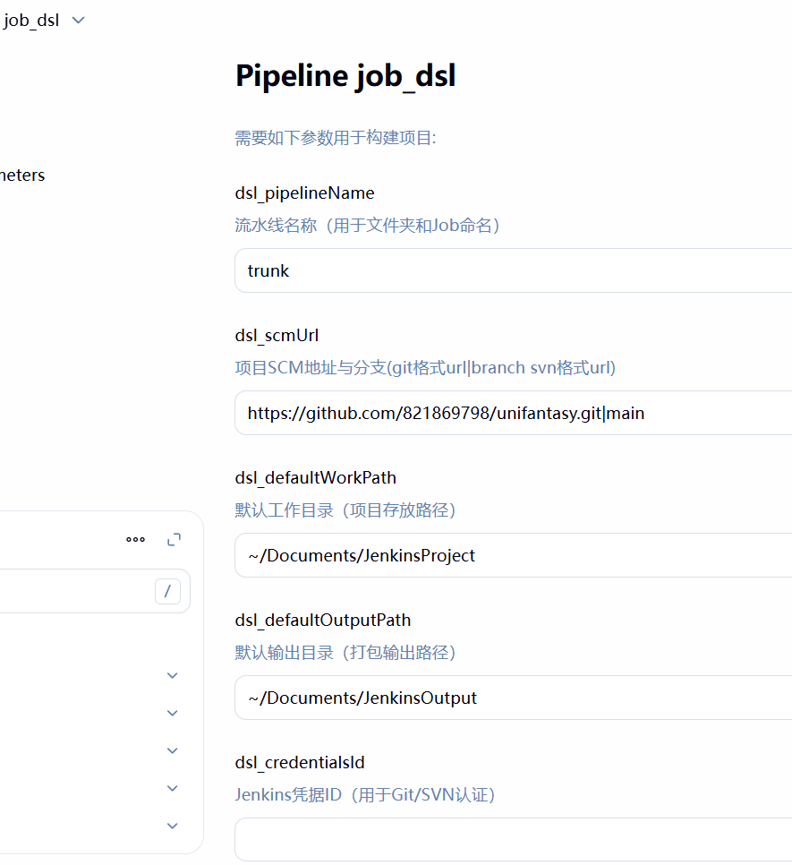

### 参数说明

- dsl_pipelineName ： 创建出来的流水线的开头名字
- dsl_scmUrl：就是打包的Unity工程的项目地址，这里可以用我的开源项目[unifantasy](https://github.com/821869798/unifantasy.git)测试
- dsl_defaultWorkPath: 拉取工程的目录，`~/` 表示用户目录，Mac在evn.Home，Windows就是C:/Users/用户名
- dsl_defaultOutputPath: 打包后的输出路径
- dsl_credentialsId: 账号凭证，针对工程地址为私有项目工程，需要先在Jenkins管理的Credentials中添加才能生效，具体可以看网上教程，开源项目不需要设置这个

## 使用DSL Piepline维护Unity自动打包Jobs

点击Build Now之后，回到主页可以看到面板上多个多个文件夹

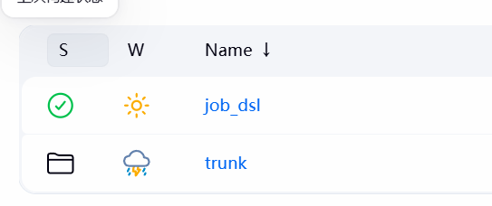

点进文件夹可以看到很多Jobs

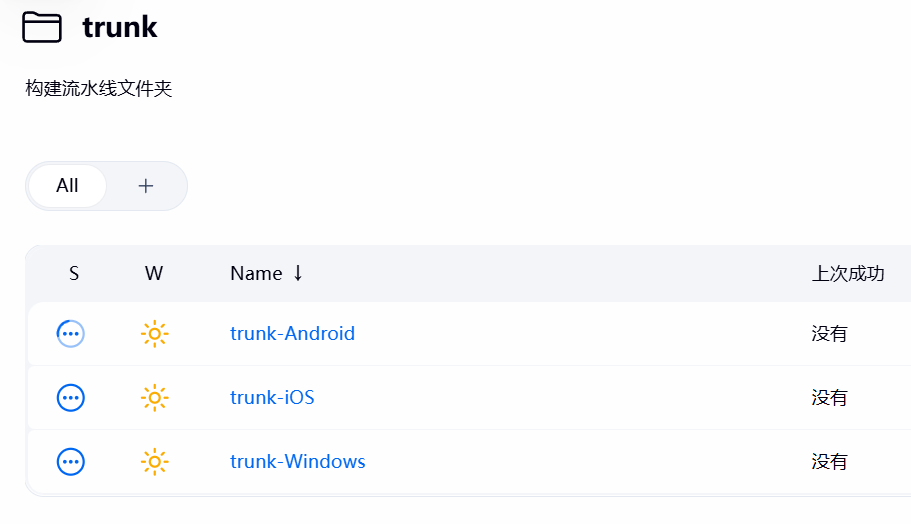

**之后如果构建的groovy脚本更新，需要更新这些job时，可以再次运行create-unity-build-job，也就是DSL的维护遍历性，程序只需要更新groovy脚本上传到git仓库，使用Jenkins的人就可以批量的更新这些Unity自动打包的job**

## 使用Jenkins来自动打包

以打包Android举例，点击trunk-Android,然后点击`Build with Parameters`,根据自己需求改动参数（截图没显示全参数，参数也可以扩展），然后点击Build就可以出包了。首次打包会需要更多时间，因为涉及拉取工程，以及Unity导入工程很耗时。

推荐的使用情景是：打包机挂载局域网共享硬盘到本地磁盘，outputPath设置到这个共享磁盘中，这样打包机打完，只需要在自己电脑上去这个共享局域网磁盘取包就行了。

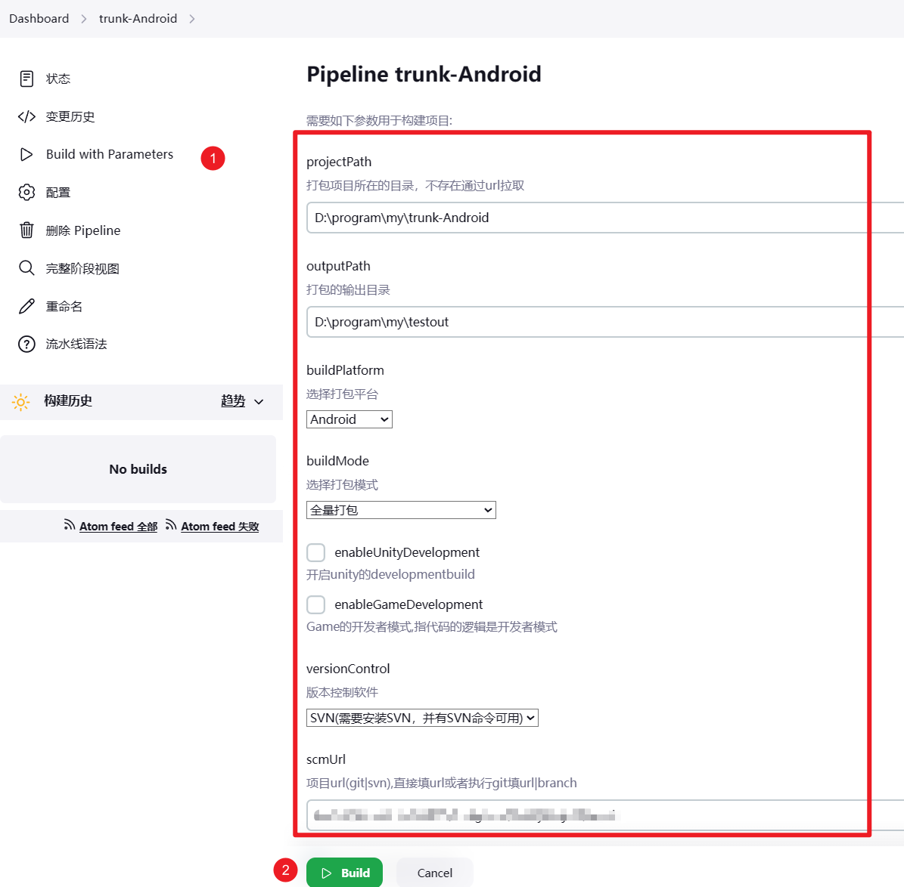


构建时，面板上可以看到流水线构建过程，点击下图中框选区域的随意一个流水线块可以看到日志，也可以按下图箭头点击构建号，左侧面板有个`Console Output`可以看到详细日志

> 如果没有阶段试图，请安装`Pipeline: Stage View`插件

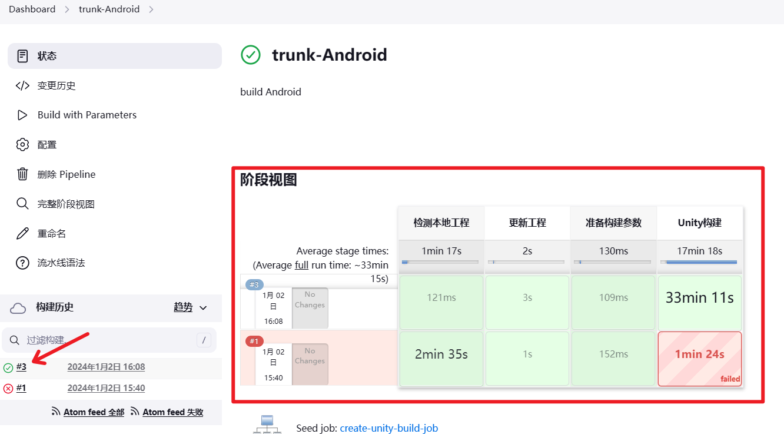

## iOS打包配置说明

按照上面的教程把jenkins安装，部署在Mac电脑上后，需要以下安装和配置。

- 安装XCode
- 安装Xcode Command Line，可以在命令行中输入`xcode-select --install` 的方式安装
- 安装p12证书
- 有对应mobileprovision证书描述文件，至少1个。类型有app-store, development, enterprise, ad-hoc

### 证书索引配置

示例工程中，有个`iOSSigningConfig.yaml`文件，其中就是配置你存在的mobileprovision证书描述文件供打包使用。其中`unity_pipeline.groovy`代码有这个一句读取配置文件的代码

```groovy
def iOSYamlText = readFile(file: "${projectPath}/Tools/AutoBuild/iOSSigningConfig.yaml") 
```

仓库中也有`iOSSigningConfig.yaml`示例文件，请使用自己的证书信息替换这些配置信息，`test_ad-hoc.mobileprovision`可以删除掉。
文件的示例内容如下：

```yaml
# jenkins中有3个CheckBox选项，1:对应appstore包，2:对应development包 3:对应企业证书包。 可以缺省，但是jenkins里不要选
# 这里我是只有一个ad-hoc证书，来代替1,2了。
signings:
  1:
    # 自定义ipa包的文件前缀
    filePrefix: "appstore_"
    codeSignIdentity: "Apple Distribution: Yueyang Yuncai Engineering Labor Service Co., Ltd (LD9X6CBJK2)"
    mobileprovisionFilePath: "iOS_Signing/test_ad-hoc.mobileprovision"
    # 根据证书来写，app-store, development, enterprise, ad-hoc
    signingMethod: ad-hoc
  2:
    filePrefix: "dev_"
    codeSignIdentity: "Apple Distribution: Yueyang Yuncai Engineering Labor Service Co., Ltd (LD9X6CBJK2)"
    mobileprovisionFilePath: "iOS_Signing/test_ad-hoc.mobileprovision"
    signingMethod: ad-hoc
```

该配置文件可以放在工程里，然后可以选择证书描述文件(mobileprovision)是放在工程里的，还是放在远程仓库中的，如果放在远程仓库的，每次打包会拉取下来。

`signings`字段的1、2、3对应的是jenkins的打包的iOS证书类型选项。

如果是第一次用该证书打包，会出现codesign弹框卡住要求输入密码，可以输入后选择始终允许，之后就不会卡住，一口气无人值守打完ipa包。

打包建议，可以勾选使用重签加速打包，第一个包是正式打包(一般是app-store类型的包)。然后测试包用重签快速出ipa，大幅提升出多个ipa的速度。

### 其他注意

**游戏不要使用com.unity3d.开头的包名 (应该没有游戏会去冒用Unity公司的包名吧！)。**

因为本项目打iOS包的时候会根据mobileprovision描述文件自动替换包名，所以跟iOS的证书跟Unity项目中设置的包名不一致也无所谓的。但是com.unity3d.开头的包名不会被替换，因为自从Unity2019后导出XCode工程会带一个UnityFramework的项目，这个项目包名是com.unity3d.unityframework，以及一个Tester项目是com.unity3d开头的。

## TODO 

后续需要根据项目需求扩展` create_jobs_dsl.groovy` 和 `unity_pipeline.groovy`和脚本，比如打包后的特殊处理，以及添加热更资源版本构建的groovy脚本。

 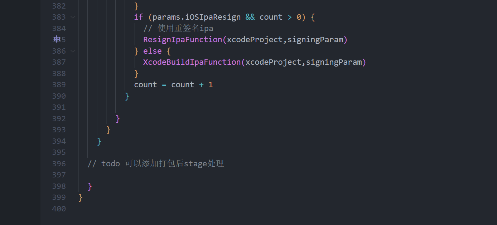
