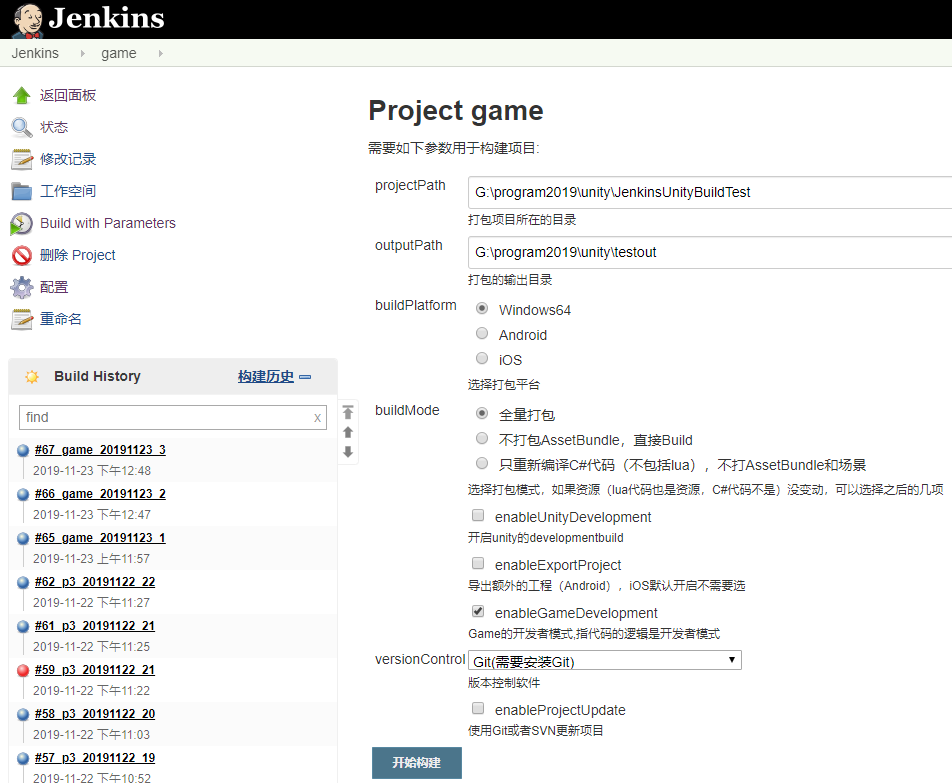

# JenkinsUnityAutoBuild

# 介绍
> JenkinsUnityAutoBuild 是一套基于Jenkins的Unity3d自动打包框架，Unity代码工程基于Unity2018  
qq:821869798
### 支持的特性有
- 参数化构建
- 部署多平台支持（可搭建在Windows或MacOS上）
- 打包多平台支持（Windows、Android、iOS），可扩展

# 示例

# 部署

1. 下载jenkins.war,并使用 java -jar jenkins.war启动jenkins，并安装以下插件
    - Unity3d
    - Build Name and Description Setter
    - Version Number
    - Extended Choice Parameter
    - Environment Injector
    - AnsiColor

    > 提示如果是部署在Windows，需要安装Git基础版，把Git安装目录下的bin目录添加到环境变量中。因为在Windows上用到了shell脚本，环境变量中需要sh.exe来执行shell脚本，Git的bin目录下带了一份

2. 配置Unity3d的路径
    - 在 Manage Jenkins -> Global Tool Configuration -> Unity3d 下配置已经装好的Unity目录，目录配置到Editor目录的父目录就可以了，不是Unity.exe所在的目录
    
    > 如果是打包Android，需要在用Unity3d创建个项目，设置好Unity3d中的Android SDK目录，并打包一次空工程，这个主要是确认在Unity3d的手动打包Android的环境是没问题的。

3. git clone 本项目到本地路径中

4. 配置Jenkins项目
    - 新建一个名为game的自由风格的Jenkins项目
    - 找到路径.jenkins/jobs/game/config.xml的文件
    > .jenkins在MacOS上位的目录在home目录下即~/.jenkins,Windows的.jenkins目录位置为C:\Users\用户名\.jenkins 下
    - 使用本项目中根目录下的config.xml替换上述文件，并重启jenkins
    - 在jenkins项目的配置中，选择构建，在步骤Invoke Unity3d Editor -> Unity3d installation name 选择之前在Global Tool Configuration中配置好的Unity3d的名字，并保存。

5. 启动打包，输入参数，确认。
    - 在jenkins中打开项目选择 Build with Parameters
    - 输入projectPath为本项目所在的本地路径
    - 输入outputPath，打包输出的目标路径
    - 选择可选参数
    - 开始构建
    - 可以点击Build History，选择左边面板中的控制台输出查看构建过程中的日志

### 关于Windows下Jenkins的控制台输出中文乱码的解决方法
1. Jenkins-> Manage Jenkins -> Configure System ，在全局属性新建变量

键为：LANG

值为：zh_CN.UTF-8

2. 添加环境变量

键：JAVA_TOOL_OPTIONS

值：-Dfile.encoding=UTF-8

(别忘了前面的-)

3. 设置好之后关闭jenkins，也就是关闭启动jenkins的CMD（需要重新载入环境变量），重新开一个CMD启动java -jar jenkins.war
